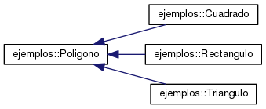

Ejemplos de orientación a objetos con C++
==========================================

# Uso de clases abstractas

[Fichero principal EjemploClasesAbstractas.cpp
](https://github.com/javism/EjemplosCpp/blob/master/src/EjemploClasesAbstractas.cpp "")

[Implementación clases
](https://github.com/javism/EjemplosCpp/tree/master/src/ClassesAbstractas "")

Este ejemplo demuestra cómo utilizar clases abstractas en C++. El objetivo del ejemplo es mostrar cómo una clase madre abstracta define una interfaz de programación común para las clases o programas que la utilicen.

En este ejemplo la clase madre Poligono define la funcion area(), y obliga a las clases hijas a implementar esta función. En el ejemplo las clases Cuadrado y Rectángulo son clases hijas que implementan la función area().



El código del programa principal tiene una función que recibe un objeto de la clase madre (Polígono), y llama a la función area().

void imprime_area(Poligono* pol)

En el código se declara primero un objeto rectángulo y otro cuadrado y se llama a imprime_area() pasándole cada vez un objeto. 

Esto es porsible porque en OO una variable del tipo clase madre puede contener objetos del tipo de las clases hijas.

En la segunda parte del código se utiliza una clase que usa la clase Poligono de forma genérica. Así, podemos configurar la clase UsadoraPoligono fijando el objeto de tipo polígono en un rectángulo o en un cuadrado. La clase UsadoraPoligono se desacopla de qué subclase recibe, simplemente llama a area() que es la interfaz que proporciona la clase superior.

# Ordenación de estructuras de datos con objetos propios

Como otras estructuras de datos, las listas de C++ en STD tienen un método sort para ordenarla. El uso del método depende de que los objetos se sepan comparar. Es decir, para enteros, cadenas y otros tipos predefinidos el compilador sabe cómo se comparan porque tienen una serie de operadores de comparación defindos.

A menudo tendremos una lista de objetos de una clase que hemos definido, que no son comparables, si llamamos al método std::list.sort() obtendremos un error ya que no hay definido ningún operador de comparación. En C++ tenemos tres formas de utilizar el método sort para cualquier tipo o clase que definamos:

## Proporcionar una función que compare dos elementos.

Esto sería válido tanto para tipos de estructuras o clases. Tenemos dos opciones aquí, la primera, declarar e implementar una función y pasar su nombre a sort como parámetro:

```C++
bool funcion_compara_rectangulos(const Rectangulo& r1, const Rectangulo& r2) {
return r1.getAncho() < r2.getAncho();
}
...
lista1.sort(funcion_compara_rectangulos);
```
La segunda, definir una función lambda como parámetro de sort, sólo para C++ (en g++ debéis usar la opción -std=C++11). 

```C++
lista3.sort( [](const Rectangulo &x, const Rectangulo &y) { return x.getAlto() > y.getAlto(); } );
```
  
## Sobrecargar el operador < 

Sobrecargar el operador < en la clase del objeto que va a contener la lista para establecer cuál de dos elementos es mayor que otro. Obiamente sólo es válido para clases.

```C++
class Rectangulo: public Poligono {
  private:
    float _ancho;
    float _alto;
  public:
    ...
    bool operator < ( const Rectangulo& r )
    {
      return this->_alto < r.getAlto();
    }
};
```

Estas tres soluciones se encuentran en el ejemplo [EjemploSortListas.cpp](https://github.com/javism/EjemplosCpp/blob/master/src/EjemploSortListas.cpp)
